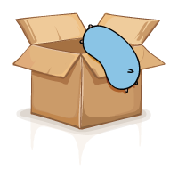
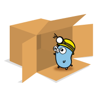
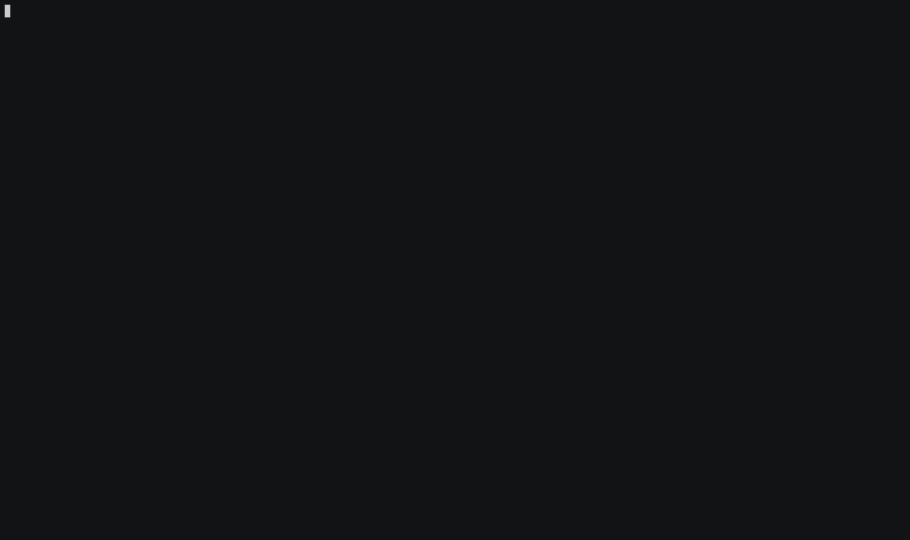

  

# fuzzy
[](https://travis-ci.org/sahilm/fuzzy)
[](https://godoc.org/github.com/sahilm/fuzzy)

Go library that provides fuzzy string matching optimized for filenames and code symbols in the style of Sublime Text, 
VSCode, IntelliJ IDEA et al. This library is external dependency-free. It only depends on the Go standard library.

## Demo

Here is a [demo](_example/main.go) of matching various patterns against ~16K files from the Unreal Engine 4 codebase.



You can run the demo yourself like so:

```
cd _example/
go get github.com/jroimartin/gocui
go run main.go
```

## Usage

```go
package main

import (
	"fmt"

	"github.com/sahilm/fuzzy"
)

func main() {
	pattern := "mnr"
	data := []string{"game.cpp", "moduleNameResolver.ts", "my name is_Ramsey"}

	matches := fuzzy.Find(pattern, data)

	for _, match := range matches {
		fmt.Println(match.Str)
		// Output:
		// my name is_Ramsey
		// moduleNameResolver.ts
	}
}
``` 

Check out the [godoc](https://godoc.org/github.com/sahilm/fuzzy) for detailed documentation.

## Installation

`go get github.com/sahilm/fuzzy` or use your favorite dependency management tool.

## Speed

Here are a few benchmark results on a normal laptop.

```
BenchmarkFind/with_unreal_4_(~16K_files)-4         	      50	  30668915 ns/op
BenchmarkFind/with_linux_kernel_(~60K_files)-4     	      20	  70854081 ns/op
```

Matching a pattern against ~60K files from the Linux kernel takes about 70ms.

## Contributing

Everyone is welcome to contribute. Please send me a pull request or file an issue. I promise
to respond promptly.

## Credits

* The algorithm is based of the awesome work of [forrestthewoods](https://github.com/forrestthewoods/lib_fts/blob/master/code/fts_fuzzy_match.js). 
See [this](https://blog.forrestthewoods.com/reverse-engineering-sublime-text-s-fuzzy-match-4cffeed33fdb#.d05n81yjy)
blog post for details of the algorithm.

* The artwork is by my lovely wife based on the Go Gopher.

* The Go gopher was designed by Renee French (http://reneefrench.blogspot.com/). 
The design is licensed under the Creative Commons 3.0 Attributions license.

## License

The MIT License (MIT)

Copyright (c) 2017 Sahil Muthoo

Permission is hereby granted, free of charge, to any person obtaining a copy
of this software and associated documentation files (the "Software"), to deal
in the Software without restriction, including without limitation the rights
to use, copy, modify, merge, publish, distribute, sublicense, and/or sell
copies of the Software, and to permit persons to whom the Software is
furnished to do so, subject to the following conditions:

The above copyright notice and this permission notice shall be included in all
copies or substantial portions of the Software.

THE SOFTWARE IS PROVIDED "AS IS", WITHOUT WARRANTY OF ANY KIND, EXPRESS OR
IMPLIED, INCLUDING BUT NOT LIMITED TO THE WARRANTIES OF MERCHANTABILITY,
FITNESS FOR A PARTICULAR PURPOSE AND NONINFRINGEMENT. IN NO EVENT SHALL THE
AUTHORS OR COPYRIGHT HOLDERS BE LIABLE FOR ANY CLAIM, DAMAGES OR OTHER
LIABILITY, WHETHER IN AN ACTION OF CONTRACT, TORT OR OTHERWISE, ARISING FROM,
OUT OF OR IN CONNECTION WITH THE SOFTWARE OR THE USE OR OTHER DEALINGS IN THE
SOFTWARE.

